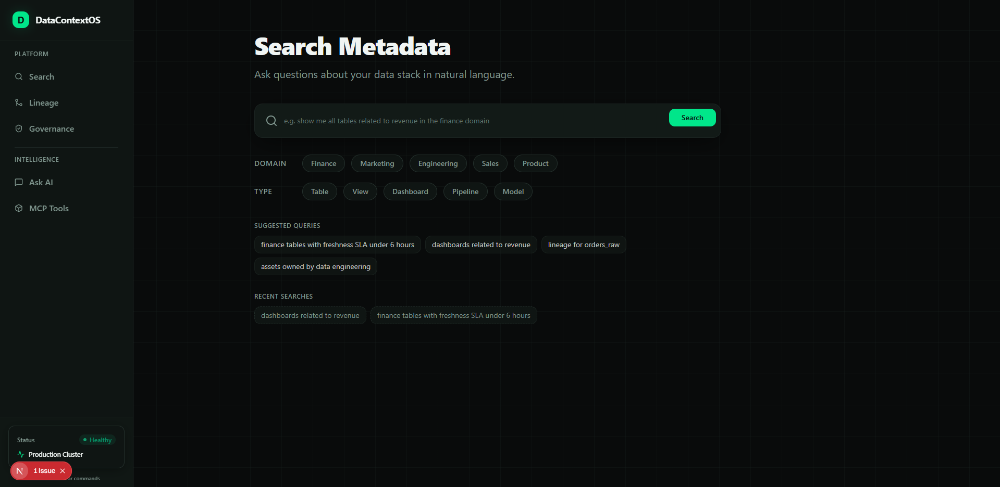

<div align="center">
  
</div>

# DataContextOS 🧠

[](https://python.org)
[](https://fastapi.tiangolo.com)
[](https://nextjs.org)
[](https://opensource.org/licenses/MIT)

> **An AI-Native Metadata Intelligence Platform powering your enterprise data stack with Agentic RAG, Model Context Protocol (MCP), and automated Trust Scoring.**

[Documentation](./docs/USAGE.md) •
[Features](#-key-features) •
[Getting Started](#-getting-started) •
[Architecture](#-architecture)

---

## 📖 Overview

**DataContextOS** transforms your fragmented data catalog into an intelligent, conversational knowledge graph. By combining advanced **Agentic RAG**, automated **Lineage Traversal**, and composite **Trust Scoring**, it allows data teams, engineers, and AI agents to query enterprise data assets—understanding their meaning, origins, ownership, and quality—entirely through natural language.

Whether you run it fully locally at zero-cost or scale it using premium APIs, DataContextOS acts as the ultimate intelligence layer for your modern data stack.

---

## ✨ Key Features

- 🤖 **Agentic RAG Engine**: A sophisticated multi-agent workflow (built on LangGraph principles) that intelligently routes queries, retrieves semantic context, traverses lineage, and synthesizes answers.
- 🔌 **Model Context Protocol (MCP)**: Native MCP server integration allows external AI assistants (like Anthropic's Claude) to seamlessly interact with your enterprise data catalog directly from your IDE.
- 🛡️ **Automated Trust Scoring**: Empirically evaluate the health of your assets with composite scores based on documentation quality, data freshness, active ownership, test coverage, and historical usage.
- 🔄 **Universal Ingestion**: Pre-built connectors parse and ingest metadata from `dbt` manifests, SQL databases, OpenAPI specifications, and markdown documentation.
- 🌓 **Dual-Mode Architecture**: 
  - **Free/Local Mode**: Run entirely locally with zero cost using `Ollama`, `Gemini`, `HuggingFace`, and `ChromaDB`.
  - **Production Mode**: Scale with enterprise-grade providers like `OpenAI`, `Anthropic`, `Cohere`, and `pgvector`.
- 📊 **Premium Dashboard**: A beautifully designed, neon-dark Next.js dashboard for visualizing lineage graphs, governance reports, and interacting with the AI context layer.

---

## 🏗 Architecture

DataContextOS is built with modularity and extensibility in mind:

1. **Ingestion Pipeline**: Standardizes metadata from diverse sources (dbt, SQL, Docs) into unified `Asset` objects.
2. **Context Layer**: Generates embeddings (via HuggingFace/OpenAI) and stores them in a highly optimized vector database (Chroma/pgvector).
3. **Intelligence Layer**: The Agentic RAG engine orchestrates specialized agents:
   - *Router Agent*: Determines intent (Search vs. Lineage vs. Governance).
   - *Retrieval Agent*: Fetches semantically relevant context.
   - *Trust Agent*: Computes real-time data health scores.
   - *Synthesis Agent*: Generates accurate, cited, natural language responses.
4. **Presentation Layer**: Exposes functionalities via a robust CLI, an asynchronous FastAPI backend, a Next.js frontend, and an MCP Server.

---

## 🚀 Getting Started

For a comprehensive guide, please refer to the [Full Runbook](docs/USAGE.md).

### 1. Prerequisites
- Python 3.11+
- Node.js 18+ (for the dashboard)
- Docker & Docker Compose (optional, for infrastructure)

### 2. Environment Setup

Clone the repository and set up your Python virtual environment:

```bash
git clone https://github.com/your-org/DataContextOS.git
cd DataContextOS

# Create and activate virtual environment
python -m venv .venv
source .venv/bin/activate  # On Windows: .\.venv\Scripts\Activate.ps1

# Install dependencies
pip install -e ".[dev,test,free,prod]"

# Configure environment variables
cp .env.example .env
```

### 3. Ingest Sample Data

Populate your local vector database with the provided sample data (dbt models and docs):

```bash
dcos ingest sample_data/
```

### 4. Run the Stack

You can run the entire stack (FastAPI Backend, ChromaDB) via Docker:

```bash
docker-compose up -d
```

Alternatively, query the CLI directly:

```bash
dcos search "Who owns the orders table and what is its trust score?"
```

---

## 💻 Dashboard

The Next.js dashboard provides a premium UI to explore your catalog, trace lineage, and chat with the AI.

```bash
cd dashboard
npm install
npm run build
npm run start
```
Visit `http://localhost:3000` to access the DataContextOS interface.

---

## 🛠 Development & Testing

We enforce strict quality standards using `mypy`, `eslint`, and `pytest`.

```bash
# Run backend tests
pytest tests/

# Run type checking
mypy .

# Lint the frontend
cd dashboard
npm run lint
```

---

## 🤝 Contributing

We welcome contributions! Please feel free to submit Pull Requests, report issues, and suggest new features to help improve DataContextOS.

---

## 📄 License

This project is licensed under the MIT License.
